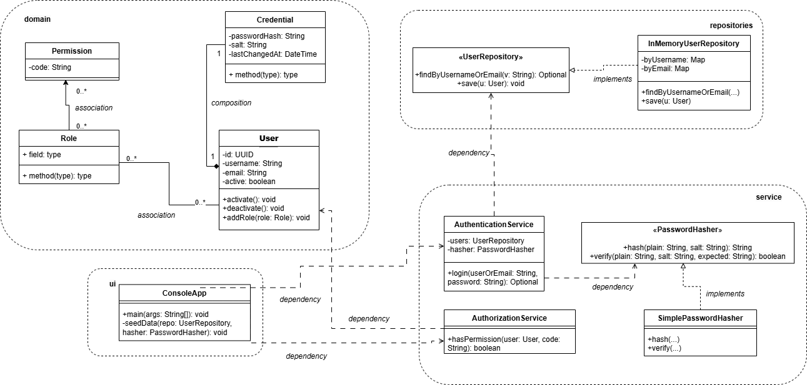

# OOP Auth Model — Java (Console)

A small Java console application that implements a simplified authentication + authorization model (similar in spirit to an Identity Server).  
This project is designed to demonstrate **Object-Oriented Programming (OOP)** and **UML → Code** translation.

## Features
- Login using **username or email + password**
- Role-based authorization (RBAC)
- Permission checks (e.g., `CATALOG_UPDATE`)
- In-memory repository (no database required)
- Clear package separation: `domain`, `repositories`, `services`, `ui`

## UML Design



## Project Structure
```text
src/
└── main/
    └── java/
        ├── domain/
        ├── repositories/
        ├── services/
        └── ui/
docs/
└── uml/